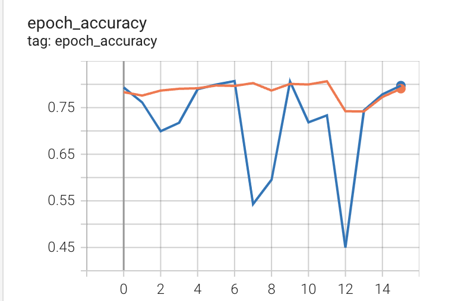
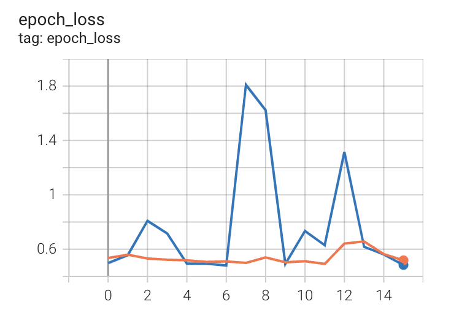

# ECG and PCG Signal Classification with CNN-LSTM on TPU

This project involves the classification of exercise intensity levels based on ECG and PCG signals using a CNN-LSTM model trained on TPUs. The model is built and trained using TensorFlow and Keras, with support for visualization using TensorBoard.

## Requirements

- Python 3.x
- TensorFlow 2.x
- Google Cloud TPU or Colab TPU
- Jupyter Notebook

## Setup

1. **Install dependencies**:
   ```bash
   pip install tensorflow sklearn numpy scipy


2.	Load the data:
- Ensure your data is structured correctly and available in the specified format (ECG and PCG signals as input).

- Download the files using your terminal:

    wget -r -N -c -np https://physionet.org/files/ephnogram/1.0.0/

3.	Prepare the environment:
Make sure your runtime environment is set to use a TPU.

Data preprocessing:
    - Load .mat file
    - Concat ECG first row and PCG signals
    - split each sample with 10k points out of len(signal)
    - get the labels for each sample in ECGPCGSpreadsheet.csv
    - output: all_labels with shape (numsample, num_features, dim) = (64k, 10k, 2)
Training the Model 2 modes:
    - Model achitechture
            Input > Con1D(64,3) > MaxPooling(2) > Con1D(128,3) > MaxPooling(2) > BatchNormalization > LSTM(64) > Dense(128) > Dense(6)
    - Train with CPU
        Training step by step in file ECGPCG_Classification.ipynb
    - Train with TPU
        Training step by step in file ECGPCG_Classification-TPUs.ipynb
            1.	Initialize TPU
            2.  Build the model:Define the CNN-LSTM model within the TPU strategy scope.
            3.	Compile the model:
            4.	Train the model: Use TensorBoard for monitoring.
            5.	Evaluate and save the model


Visualizing Results with TensorBoard

	1.	Run TensorBoard in Jupyter Notebook:
        %load_ext tensorboard
        %tensorboard --logdir logs/fit

	2.	Inspect the graphs:
View loss, accuracy, and other metrics over training epochs.

3. Results
    Train Acc:
        
    
    Train Loss:
        